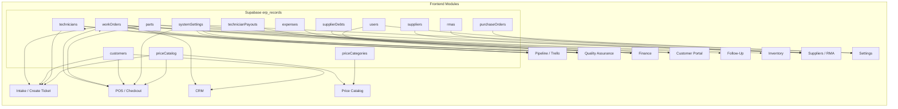

# i35 ERP System — အသေးစိတ် Workflow Documentation

> **System:** i35 Apple Service ERP (React SPA + Express/Vite Server + Supabase)  
> **Live URL:** https://erp.i35appleservice.com  
> **Lite URL:** https://erplite.i35appleservice.com (inventory/suppliers/PO မပါ)  
> **Auth:** Email/Password (scrypt hash) + Session Token (SHA-256, TTL 30 days)

---

## မာတိကာ

1. [Architecture Overview](#1-architecture-overview)
2. [Data Layer (Server Proxy + Offline Queue)](#2-data-layer)
3. [Dashboard](#3-dashboard)
4. [Intake / Create Ticket](#4-intake--create-ticket)
5. [Pipeline (Trello Board)](#5-pipeline-trello-board)
6. [Quality Assurance (QA)](#6-quality-assurance-qa)
7. [POS / Checkout](#7-pos--checkout)
8. [Finance (P&L, Commissions, Expenses)](#8-finance)
9. [CRM (Customer Management)](#9-crm-customer-management)
10. [Price Catalog](#10-price-catalog)
11. [Settings (System Management)](#11-settings)
12. [Customer Portal](#12-customer-portal)
13. [AI Assistant](#13-ai-assistant)

---

## 1. Architecture Overview

### Stack

```
┌─────────────────────────────────────────────────────────────────────┐
│                         Browser (React SPA)                         │
│  App.tsx ← Navigation.tsx ← lazyWithRetry(Module.tsx)              │
│  supabase.ts ← proxyFetch() → /api/data/*                          │
│  indexedDB.ts ← OfflineQueue (IndexedDB)                            │
└──────────────────────────┬──────────────────────────────────────────┘
                           │ HTTP (same origin, Caddy reverse proxy)
                           ▼
┌─────────────────────────────────────────────────────────────────────┐
│              Express Server (server.ts, port 3100)                  │
│  - Auth (login/logout/verify, session tokens, brute-force guard)   │
│  - Data Proxy (GET/POST /api/data/* → Supabase REST)               │
│  - AI chat (OpenAI/Anthropic/Gemini/DeepSeek/OpenRouter)           │
│  - Gemini Diagnose (+ Draft Message)                               │
│  - Telegram Bot (long-poll, live ERP context)                      │
│  - Static SPA serving (Brotli, immutable cache)                    │
│  - Security: helmet headers, CORS, rate-limit, audit log, CSP      │
└──────────────────────────┬──────────────────────────────────────────┘
                           │ SUPABASE_SERVICE_ROLE (server-side only)
                           ▼
┌─────────────────────────────────────────────────────────────────────┐
│            Supabase (PostgreSQL 17.6.1, ap-southeast-1)            │
│  Table: erp_records (collection_name, id, data JSONB, updated_at)  │
│  Collections: workOrders, parts, customers, technicians, ...       │
│  No realtime subscription (polling replacement)                    │
└─────────────────────────────────────────────────────────────────────┘
```

### Data Model (Single Table)

`erp_records` တစ်ခုတည်းမှာ collection_name နဲ့ ခွဲထားပါတယ် — JSONB `data` ကော်လံမှာ record တစ်ခုချင်းစီရဲ့ data အကုန်ရှိတယ်။

| Collection Name | သဘောတရား | Key Fields (data JSONB ထဲက) |
|---|---|---|
| `workOrders` | Repair ticket တစ်ခုချင်းစီ | orderNumber, status, deviceModel, customerName, lineItems, totalAmount, isPaid, assignedTechId |
| `parts` | Inventory part တစ်ခုချင်းစီ | sku, name, category, quantityInStock, costPrice, sellingPrice, qualityTier, supplierName |
| `customers` | Customer records | name, phone, email, type, totalSpent, discountPercentage |
| `technicians` | Technician profiles | name, level, commissionRate, status |
| `technicianPayouts` | Monthly commission records | period, technicianId, totalTicketsClosed, commissionAmount, status |
| `systemSettings` | Shop settings (singleton) | shopName, currencySymbol, aiProvider, disabledModules, taxRate |
| `priceCatalog` | Repair price per model | model, prices, warranties |
| `priceCategories` | Price category labels | key, label |
| `suppliers` | Parts vendors | name, code, phone, rating |
| `rmas` | Warranty returns | rmaNumber, partId, supplierId, status |
| `purchaseOrders` | Parts purchase orders | poNumber, supplierId, items, totalCost, status |
| `users` | App user accounts | name, email, role, permissions |
| `expenses` | Shop expenses | category, description, amount, date |
| `supplierDebts` | Supplier debt tracking | supplierId, invoiceNumber, totalAmount, paidAmount, status |
| `monthlyReports` | P&L monthly reports | period, revenue, expenses, profit |

### Collection → UI Module Mapping



---

---

## 2. Data Layer (supabase.ts)

### Read Flow (Polling-based)

```
Frontend Component
  │
  ├─ subscribeToCollection('workOrders', onData, initialSeed)
  │    ├─ Instantly renders from shared cache (no empty flash)
  │    ├─ Sets polling interval (15s) — replaces Supabase Realtime
  │    ├─ First call: refreshCollection() → fetchCloudCollection()
  │    │    └─ proxyFetch('GET /api/data/workOrders')
  │    │         └─ Server: Supabase REST → /rest/v1/erp_records?collection_name=eq.workOrders
  │    │              └─ Returns: { success, rows: [data, data, ...] }
  │    └─ Returns unsubscribe function (clears timer, removes listener)
  │
  └─ 45s safety refresh (App.tsx interval): flushOfflineQueue → refreshAllCollections()
```

### Write Flow (Optimistic + Offline Queue)

```
saveDocument('workOrders', updatedWorkOrder)
  │
  ├─ applyLocalChange(): Optimistic UI update (instant)
  │    └─ Patches shared collection cache → all listeners re-render
  │
  ├─ if offline → addToQueue({ collectionName, action: 'save', data })
  │    └─ IndexedDB queue (offlineQueue.ts)
  │
  ├─ if online → proxyFetch('POST /api/data/save', { collection, rows })
  │    └─ Server: Supabase REST POST /rest/v1/erp_records?on_conflict=collection_name,id
  │         with Prefer: resolution=merge-duplicates
  │
  └─ On success → flushOfflineQueue() (replay any backlog)
       └─ Stale-write guard: compare updatedAt timestamps
```

### Offline Queue Details

| Action | Queue Item | Flush Behavior |
|---|---|---|
| `save` | `{ collectionName, action:'save', data }` | POST /api/data/save |
| `batch` | `{ collectionName, action:'batch', data: [] }` | POST /api/data/save (array) |
| `delete` | `{ collectionName, action:'delete', data: { id } }` | POST /api/data/delete |
| `clear` | `{ collectionName, action:'clear', data: null }` | POST /api/data/clear (admin only) |

---

## 3. Dashboard

**File:** `src/components/dashboard/DashboardOverview.tsx`  
**Collection:** workOrders, parts, technicians  
**Lazy-loaded:** ✅

### UI Components

| အပိုင်း | ဖော်ပြချက် |
|---|---|
| **Status Queue** (မူလ tab) | Active tickets grouped by status — Receive, In Progress, Pending, Finished |
| **Repair Data** | Charts: revenue bars + completed repairs line (recharts) |
| **Tech KPI** | Per-technician performance metrics |
| **Inventory** | Stock health, low-stock warnings, fund balance |
| **Finance** | Revenue snapshot, outstanding payments |
| **Warranty Watch** | Recently completed tickets still under warranty |

### Metrics Calculations

```
Active Tickets    = workOrders.filter(wo → wo.status ∉ [Finished, Taken Out, Cant Repair, Customer Not Repair])
Today Completed   = workOrders.filter(wo → wo.status ∈ [Finished, Taken Out] && today)
Today Revenue     = Today Completed → sum(totalAmount)
Low Stock Parts  = parts.filter(p → p.quantityInStock <= p.reorderPoint)
Outstanding      = workOrders.filter(wo → !wo.isPaid) → sum(totalAmount - paidAmount)
```

### Sub-Tab Navigation

Dashboard sub-tab state is controlled by `dashboardSubTab` in App.tsx.  
Dashboard exposes `setSubTab()` via `forwardRef`/`useImperativeHandle`.

---

## 4. Intake / Create Ticket

**Files:**
- `IntakeWorkOrderModule.tsx` — Ticket roster (table/cards view)
- `CreateTicketSoloPage.tsx` — New ticket form (full-page)
- `SimpleTicketCreator.tsx` — Quick ticket form (modal)

### 5.1 Ticket Roster (IntakeWorkOrderModule)

```
┌─ Data Flow ─────────────────────────────────────────────────┐
│ workOrders[] ← subscribeToCollection('workOrders')          │
│ customers[] ← subscribeToCollection('customers')            │
│ technicians[] ← subscribeToCollection('technicians')        │
│                                                              │
│ Filters applied:                                              │
│   • statusFilter (Receive / In Progress / Pending / Finished)│
│   • dateFilter (today / week / month / custom range)         │
│   • searchQuery (orderNumber, customerName, deviceModel, SN) │
│   • sortByPriority (Urgent first)                            │
│                                                              │
│ View modes: table (columns) / cards (grid)                   │
└──────────────────────────────────────────────────────────────┘
```

### 5.2 Create Ticket Flow (CreateTicketSoloPage)

```
User fills form:
  │
  ├─ Device Info: Category, Model, Color, Serial, IMEI, Passcode
  │    └─ DeviceModelChooserModal → getAvailableColorsForModel()
  │
  ├─ Customer Info: Name, Phone, Email, Type (Retail/B2B)
  │    └─ Phone auto-search → existing customer match
  │
  ├─ Pre-Repair Diagnostics (21 checks)
  │    └─ DIAGNOSTIC_NAMES: PowerOn, Display, Touch, FaceID, Camera, etc.
  │
  ├─ Selected Repairs: Price List picker → SelectedRepairItem[]
  │    └─ PriceCatalogLookup → getModelPriceCatalogItems(model)
  │    └─ Per-item discounts (lineItemDiscountPercent)
  │
  ├─ Line Items: Labor + Parts (from inventory)
  │
  ├─ Checklist: PreRepairChecklist (powerOn, screenDisplay, touchGrid, etc.)
  │
  ├─ Symptoms: free text
  │
  ├─ Photos: Intake photos (compressImageFile → base64 data URI)
  │
  ├─ Tech Assignment: assignedTechId
  │
  └─ Save → saveDocument('workOrders', newWorkOrder)
       └─ Server POST /api/data/save
```

### 5.3 Order Number Generation

```
nextOrderNumber(from utils/orderNumbers.ts):
  year = new Date().getFullYear()  // 2026
  Find max existing orderNumber matching "WO-{year}-"
  Increment: WO-2026-1001 → WO-2026-1002
```

### 5.4 Edit Flow

```
User clicks Edit on a ticket → navigate to CreateTicketSoloPage
  └─ ticketPrefill.editWorkOrder = existing WorkOrder
  └─ Form pre-populated with all fields
  └─ Save → saveDocument('workOrders', updatedWorkOrder) (merges by id)
```

---

## 5. Pipeline (Trello Board)

**File:** `src/components/trello/TrelloBoardModule.tsx`  
**Data:** workOrders, technicians, systemSettings

### Stage Columns

| Column | Status | သဘောတရား |
|---|---|---|
| Received | Receive | Device received, not yet assigned |
| In Progress | In Progress | Tech is working on repair |
| Pending | Pending | Waiting for parts, customer approval, etc. |
| Finished | Finished | Repair done, waiting for pickup |
| Taken Out | Taken Out | Customer collected |
| Can't Repair | Cant Repair | Cannot repair (declined status) |
| Customer Not Repair | Customer Not Repair | Customer declined repair |

### Drag-and-Drop Status Change

```
User drags card from "Received" to "In Progress"
  │
  ├─ onUpdateWorkOrderStatus(woId, 'In Progress')
  │    └─ setWorkOrders(prev → map: update status + statusChangedAt)
  │    └─ saveDocument('workOrders', updatedWo)
  │
  ├─ Auto stock reservation (if autoReserveOnAssignment enabled):
  │    └─ For each lineItem with partId:
  │         └─ parts.find(p → p.id === partId) → reservedQuantity += qty
  │         └─ saveDocument('parts', updatedPart)
  │
  └─ Repair log entry: { note, statusChange, timestamp }
       appended to wo.repairLogs[]
```

### Tech Filter & Date Filter

```
Tech Filter: 'ALL' | 'unassigned' | specific technician id
  └─ Filters workOrders by assignedTechId || assignedTechName

Date Filter: all / today / 7d / 30d / custom range
  └─ isDateMatchingFilter(wo.createdAt, dateFilter)
```

### Technician Role

Technician users see only their own tickets (matched by `technicianId` or `technicianName`).

---

## 6. Quality Assurance (QA)

**File:** `src/components/qa/QualityAssuranceModule.tsx`  
**Data:** workOrders (Finished/Taken Out without postRepairChecklist), technicians, users

### Flow

```
1. QA Module shows tickets with status Finished/Taken Out
   AND no postRepairChecklist yet

2. User clicks "Start QA" on a ticket → QA form opens

3. QA Form:
   ├─ After-Repair Diagnostics (21 checks from DIAGNOSTIC_NAMES)
   │    └─ Status: Pass / Fail / N/A / Can't Test
   ├─ PostRepairChecklist:
   │    ├─ trueToneTransferred
   │    ├─ displayNoMessageWarning
   │    ├─ batteryHealthVerified
   │    ├─ cameraOisFunctional
   │    ├─ proximitySensorWorking
   │    ├─ speakerClarityPass
   │    ├─ enclosureAlignmentPass
   │    ├─ cleanAndSanitized
   │    └─ qaTechnicianId (inspector from users list)
   ├─ Photos: After-repair photos (compressImageFile)
   └─ Notes

4. Save → onSavePostRepairChecklist(woId, checklist, afterDiagnostics, photos)
   └─ saveDocument('workOrders', updatedWo) — patches postRepairChecklist + afterDiagnostics
```

### Error Return Flow

```
"Error Return" button on Taken Out tickets:
  └─ onErrorReturn(woId) → sets status back to 'In Progress'
       └─ saveDocument('workOrders', updatedWo)
```

### Reopen QA

```
"Reopen QA" button on post-QA tickets:
  └─ onReopenQa(woId) → clears postRepairChecklist + afterDiagnostics
       └─ saveDocument('workOrders', updatedWo)
       └─ Ticket reappears in QA roster
```

---

## 7. POS / Checkout

**Files:**
- `PosInvoicingModule.tsx` — Main POS module
- `PosCheckoutPanel.tsx` — Checkout panel (right side)
- `PosModals.tsx` — Payment/Barcode/PriceList modals
- `posUtils.ts` — Utilities (line total, discount, tax)

### Flow

```
POS Module opens → workOrders[] filtered by:
  ├─ Not yet paid (isPaid = false)
  ├─ Status: Finished / Taken Out (or Receive for deposit)
  └─ Date filter + search

User selects a ticket → right panel shows checkout:
  │
  ├─ Line Items: Labor + Parts breakdown
  │    ├─ Labor: selectedRepairs → WorkOrderLineItem[]
  │    ├─ Parts: Line items with partId & isLabor=false
  │    └─ Each line shows: unitPrice, qty, discountPercent, total
  │
  ├─ Price Adjustments:
  │    ├─ Per-item discount (lineItemDiscountPercent)
  │    ├─ Invoice-level discount (discountAmount)
  │    └─ Custom repair (Add Custom Repair)
  │
  ├─ Parts:
  │    ├─ Add Part from Inventory → reduces stock (reservedQuantity → stock)
  │    ├─ Add External Part (bought outside, no inventory tracking)
  │    └─ Price List Picker (add repair from catalog)
  │
  ├─ Payment:
  │    ├─ Payment Method: Cash / Credit Card / Apple Pay / Split Payment / Net 30
  │    ├─ Cash Tendered → change calculation
  │    ├─ Split Payment → multiple methods
  │    └─ Backdate (checkoutDate) — for past entries
  │
  └─ Confirm Payment → onMarkPaid(wo, method, completedAtIso)
       │
       ├─ setIsPaid = true
       ├─ paidAmount = totalAmount
       ├─ paymentMethod = selected
       ├─ completedAt = checkoutDate (ISO)
       ├─ statusChangedAt = now
       │
       ├─ Auto Tech Commission:
       │    ├─ Calculate commissionAmount = laborRevenue × techRate
       │    ├─ Create technicianPayout record (if not exists for period)
       │    └─ saveDocument('technicianPayouts', payoutRecord)
       │
       ├─ Inventory Consumption:
       │    ├─ For each part line item:
       │    │    ├─ Decrement quantityInStock (not reservedQuantity)
       │    │    └─ saveDocument('parts', updatedPart)
       │    └─ Set inventoryConsumedAt + inventoryConsumptionAmount
       │
       ├─ AI Classification (background):
       │    ├─ classifyRepairWithAI(wo, settings)
       │    └─ Sets repairTypeAI: 'spareparts' | 'hardware'
       │
       └─ saveDocument('workOrders', updatedWo)
            └─ POST /api/data/save
```

### Pricing Model

```
Line Item Total = unitPrice × quantity × (1 - lineItemDiscountPercent/100)
Subtotal = sum(Line Item Total) — per-item discounts applied
Invoice Discount = discountAmount (extra, on top of per-item discounts)
Tax = subtotal × taxPercentage / 100
Total Amount = subtotal - discountAmount + tax

Gross Profit = Total Amount - Parts Cost (sum of partId line items' unitCost × quantity)
Net Profit = Gross Profit - Tech Commission
```

### Profit Calculation (POS Panel)

```
Labor Revenue = sum of labor line items' final prices
Parts Cost = sum of partId line items' unitCost × quantity
Tech Commission Rate = tech.commissionRateParts (for Spareparts) or tech.commissionRateHardware (for Hardware)
Commission Amount = Labor Revenue × Commission Rate (if no distinction, use commissionRate)
Gross Profit = Total Amount - Parts Cost
Net Profit = Gross Profit - Commission Amount
```

---

## 8. Finance

**File:** `src/components/finance/ShopFinancePlModule.tsx`  
**Data:** workOrders, parts, expenses, supplierDebts, technicianPayouts  
**Lazy-loaded:** ✅

### Tabs

| Tab | Data Source | ဖော်ပြချက် |
|---|---|---|
| **Overview** | All collections | Revenue, expenses, profit summary |
| **Revenue** | workOrders (isPaid=true) | Daily/monthly revenue breakdown, payment method split |
| **Expenses** | expenses collection | Expense list, add expense form |
| **Inventory Asset** | parts collection | Total parts value, stock by category |
| **Commissions** | technicianPayouts | Monthly tech commission records, pay/approve/pending |
| **Accounts Payable** | supplierDebts | Supplier debt tracking, record payments |
| **Inventory Fund** | workOrders (inventorySettlementStatus) | Fund settlement tracking |
| **Parts Revenue** | workOrders (part line items) | Parts P&L (Overview, Sales by Day, Profit by Category, Sold by Ticket) |

### Commission Calculation

```
Per-period (monthly):
  technicianPayouts record:
    period = "2026-09"
    totalTicketsClosed = count of Finished/Taken Out tickets by this tech
    totalLaborRevenue = sum of labor line items
    commissionAmount = totalLaborRevenue × commissionRate
    netPayout = commissionAmount + bonusAmount - adjustments
```

### Record Supplier Payment

```
onRecordSupplierPayment(debtId, paymentAmount, paymentMethod, note):
  ├─ Update supplierDebt: paidAmount += paymentAmount
  ├─ If paidAmount >= totalAmount → status = 'Paid' | 'Cleared'
  ├─ Append to paymentHistory[]: { date, amount, method, note }
  └─ saveDocument('supplierDebts', updatedDebt)
```

---

---

## 9. CRM (Customer Management)

**File:** `src/components/crm/CrmCustomerPortalModule.tsx`  
**Data:** customers, workOrders

### Features

| Tab | ဖော်ပြချက် |
|---|---|
| **CRM** | Customer roster (table), add/edit/delete customer, repair history |
| **Portal Simulator** | Customer Portal test mode |

### Customer CRUD

```
Add Customer:
  ├─ Form: Name, Phone, Email, Company, Type (Retail/B2B), Discount %
  └─ saveDocument('customers', newCustomer)

Edit Customer:
  ├─ Pre-filled form
  └─ onUpdateCustomer → saveDocument('customers', updatedCustomer)

Delete Customer:
  └─ onDeleteCustomer → deleteDocument('customers', id)
```

### Customer Repair History

```
CustomerRepairHistoryModal:
  ├─ workOrders filtered by customerId
  ├─ Timeline view: status changes over time
  └─ Printable invoice for each ticket
```

### Customer Type Filter

```
Retail / B2B Corporate / ALL
  └─ Filter by customer.type
```

---

---

## 10. Price Catalog

**Files:**
- `src/components/prices/PriceCatalogModule.tsx` — Main catalog view
- `src/components/prices/PriceSettingsModal.tsx` — Category/folder settings
- `src/hooks/usePriceCatalog.ts` — Catalog data hook
- `src/utils/priceCatalogLookup.ts` — Lookup utilities

### Data Model

```
priceCatalog: ModelRepairPrice[]
  model: "iPhone 13 Pro Max"
  prices: { Display_Original: 45000, Battery_Original: 25000, ... }
  warranties: { Display_Original: "90 days", ... }

priceCategories: RepairCategoryDef[]
  key: "Display_Original" → label: "Display Original"
  key: "Battery_Original" → label: "Battery Original"
```

### Workflow

```
Catalog View:
  ├─ Models listed alphabetically
  ├─ Each model shows prices per category
  ├─ Currency symbol from systemSettings
  └─ Edit: inline edit prices, add/remove categories

Price Settings Modal:
  ├─ Manage categories (add/edit/delete)
  ├─ Manage folders (grouping)
  └─ Bulk import/export

Price List Picker (used in POS & Intake):
  ├─ getModelPriceCatalogItems(model) → ModelRepairCatalogItem[]
  ├─ Shows all repair types for selected model
  └─ Select → creates SelectedRepairItem with basePrice + discount
```

---

## 11. Settings

**File:** `src/components/settings/SystemManagementSettingsModule.tsx`  
**Data:** systemSettings, users, parts, technicians, expenses

### Settings Tabs

| Tab | File | ဖော်ပြချက် |
|---|---|---|
| **Shop Info** | TabShop.tsx | Shop name, address, phone, email, website, tax ID |
| **Users** | TabUsers.tsx | User accounts (Admin/Technician/Reception), roles, permissions |
| **Technicians** | TabTechnicians.tsx | Tech profiles, commission rates (parts vs hardware), levels |
| **Modules** | TabModules.tsx | Module visibility toggles (disabledModules) |
| **Intake** | TabIntake.tsx | Defaults: ticket prefix, warranty days, default tech |
| **POS** | TabPos.tsx | Thermal paper size, receipt header/footer, payment methods |
| **Pricing** | TabPricing.tsx | Currency, tax rate, default labor discount |
| **Inventory** | TabInventory.tsx | Categories, quality tiers, bin names, low stock threshold, auto-reserve |
| **Payment** | TabPayment.tsx | Payment method configs (bank accounts, mobile pay) |
| **Notifications** | TabNotifications.tsx | SMS/Telegram templates, auto-prompt modal |
| **AI** | TabAi.tsx | AI provider config, model, API key, system prompt |
| **QA** | TabQa.tsx | Mandatory checklist, micro-soldering log, photo requirement |
| **Recycle** | TabRecycle.tsx | Recycle bin settings, auto-delete rules |
| **Theme** | TabTheme.tsx | Color scheme, layout options |

### Settings Save Flow

```
Any tab change → settingsDirty = true
  │
  ├─ Save button → handleUpdateSettings(updatedSettings)
  │    └─ saveDocument('systemSettings', { id: 'global', ...updatedSettings })
  │
  └─ Unsaved changes warning on tab leave
```

### User Permissions

```
AppUser.permissions:
  canDeleteWorkOrders: boolean
  canDeleteInventory: boolean
  canDeleteCustomers: boolean
  canDeleteLogs: boolean
  canAccessSettings: boolean
  canAccessFinance: boolean
  canEditPrices: boolean
```

---

## 12. Customer Portal

**File:** `src/components/portal/CustomerFacingWebPortal.tsx`  
**Data:** workOrders, systemSettings

### Access Flow

```
Customer enters phone number:
  └─ normalizePhone() → digits only
  └─ makePhoneMatcher(queryDigits) → strict === match (≥9 digits)

OR
  └─ Order number + email/serial exact match

Success → shows all matching tickets:
  ├─ Ticket status (friendly labels: Received / In Progress / Finished / Collected)
  ├─ Timeline (status changes)
  ├─ Repair details (selected repairs, costs)
  └─ Invoice (printable)
```

### Estimate Approval Flow

```
Customer sees "Pending Approval" estimate:
  └─ Approve → applyEstimateApproval(wo)
       └─ estimateStatus = 'Approved'
       └─ estimateApprovedAt = now
       └─ saveDocument('workOrders', updatedWo)
       └─ Status automatically transitions

  └─ Reject → applyEstimateRejection(wo, reason)
       └─ estimateStatus = 'Rejected'
       └─ estimateRejectionReason = reason
       └─ saveDocument('workOrders', updatedWo)
```

### Customer Inquiry

```
Customer sends message:
  └─ Appended to wo.customerInquiries[]: { id, sender, text, timestamp }
  └─ saveDocument('workOrders', updatedWo)
```

---

---

## 13. AI Assistant

**Files:**
- `AiDiagnosticAssistantModal.tsx` — Chat modal (frontend)
- `server.ts` — `/api/ai/chat`, `/api/gemini/diagnose`, `/api/gemini/draft-message`
- Telegram bot (long-polling in server.ts)

### AI Chat Flow

```
User types question in AI modal:
  │
  ├─ Context gathered from live collections:
  │    ├─ workOrders (active, completed today, recent, unpaid)
  │    ├─ parts (low stock, category-specific)
  │    ├─ technicians (work history, monthly report)
  │    ├─ priceCatalog (model prices)
  │    ├─ customers, suppliers, rmas
  │    └─ systemSettings
  │
  ├─ POST /api/ai/chat
  │    ├─ Provider: local (disabled) / openai / anthropic / gemini / deepseek / groq / openrouter
  │    ├─ Server resolves API key (env vars, never sent to client)
  │    ├─ System prompt: "Reply in Myanmar, use LIVE ERP CONTEXT, never invent data"
  │    └─ Returns answer
  │
  └─ Display in chat modal
```

### AI Auto-Classification

```
Background process (in App.tsx useEffect):
  For each finished ticket without repairTypeAI:
    └─ classifyRepairWithAI(wo, settings)
         ├─ POST /api/ai/chat with system prompt: "Reply SPAREPARTS or HARDWARE"
         ├─ SPAREPARTS = modular (display, battery, camera, flex, etc.)
         ├─ HARDWARE = board-level (IC, micro-soldering, water damage, etc.)
         └─ Sets wo.repairTypeAI + wo.aiClassifyFailed (if error)
```

### AI Re-scan (Manual)

```
User clicks "Re-scan" button:
  ├─ Scans all finished tickets without verdict
  ├─ Sequential (200ms delay between calls)
  └─ Returns { classified, failed } count
```

### Gemini Diagnose

```
POST /api/gemini/diagnose { deviceModel, symptoms, panicLog, errorCodes }
  └─ Returns structured JSON:
       suspectedIssues: string[]
       diodeTestPoints: string[]
       recommendedAction: string
       requiredPartsOrTools: string[]
       estimatedDifficulty: string
       clientExplanation: string
```

### Telegram Bot

```
Long-polling Telegram bot:
  ├─ Allowed chat IDs from env TELEGRAM_ALLOWED_CHAT_IDS
  ├─ Fetches live ERP context for each message
  ├─ Maintains chat history (30 messages)
  ├─ Commands: /start, /help, /clear
  └─ Replies in Myanmar with ERP data
```

---

---

## Key Data Flow Summary

```
User Action → Frontend Component
  → optimistic state update (applyLocalChange)
  → saveDocument() / deleteDocument()
    → if online: proxyFetch → Express Server → Supabase REST
    → if offline: IndexedDB queue → flush on reconnect
  → 15s polling syncs across devices
  → 45s safety refresh + flush
```

### Critical Rules (from MEMORY.md)

1. **JSONB PATCH replaces WHOLE `data` column** — always send full object
2. **Pricing model**: parts cost + labor = bundled. Customer pays `totalAmount` = labor only. Parts line items are internal tracking.
3. **Profit formula**: `Gross Profit = Amount Due − Parts Cost`; `Net Profit = Gross Profit − Tech Commission`
4. **Discount format**: `unitPrice` = original price; `lineItemDiscountPercent` = per-item; `discountAmount` = extra invoice-level
5. **LITE MODE**: `VITE_APP_LITE=1` compile flag → excludes inventory, suppliers, PO, RMA, supplierDebts
6. **No Supabase credentials in client** — all data goes through authenticated server proxy
7. **Session lifetime governed by PHP.ini** (for Apple Art/PHP apps) — not by ini_set()